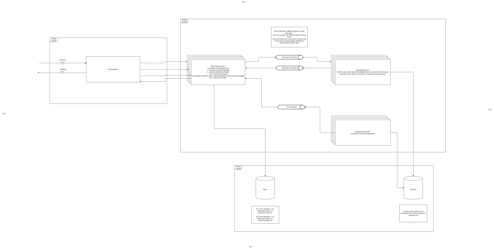

# rate_limiter

# Load managing WhatsApp API: a rate limited services

## Context & Constraints:

Third-party service WhatsApp has severe rate limitations
Each WhatsApp business number has a tier to it and suppose say it has a limit of 250 total transactions per second
and there are two types of transactions: 

1. sending messages (outbound)
2. receiving messages (inbound)

There are two types of conversations we can do: 

1. with users who are in session
2. users who are not in session

We want to prioritise near real-time sending and receiving messages to users who are in session while slowly bringing new users to the session
if we start a session, users will usually engage with us for the next 30 mins and get what they wanted

For example, now if we're going to send a campaign messages say, about an event starting in the next hour, to 2 lakh users, how can we prioritise the experiences of users who are replying to us but also reaching all of them at least before 30mins the event starts
other useful numbers:

1. once we receive the message, we will take a median of 2 seconds to generate a reply to them, and 
2. user will feel the bot is slow if it takes more than 3 seconds for the reply, maximum delay we can go is 5 seconds 
3. 50% of the users we attempted to start the session will reply and start under a minute after the first message 
4. 10 seconds for users to read and reply back 
5. assume there's already a system in place that will give take the input message and generates a reply and a service that can send the campaign details

## Solution expectations:

HLD write-up of a system that satisfies the above constraints

A POC implementation or LLD of any critical blocks of this system

## Solution

To run the code, run the simulation.py file
