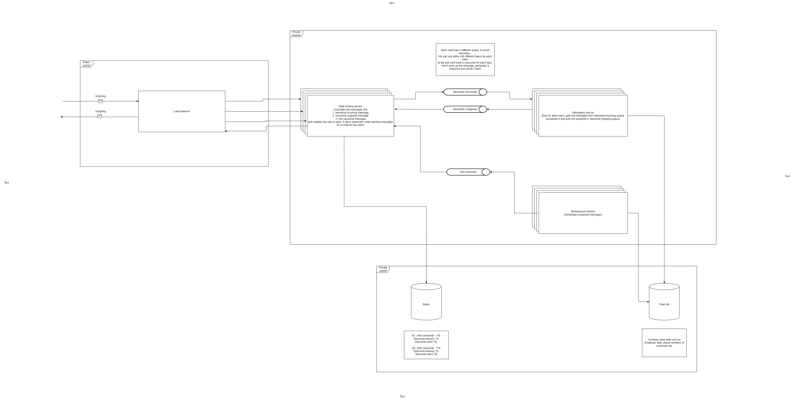

# rate_limiter

# Load managing WhatsApp API: a rate limited services

## Context & Constraints:

Third-party service WhatsApp has severe rate limitations
Each WhatsApp business number has a tier to it and suppose say it has a limit of 250 total transactions per second
and there are two types of transactions: 

1. sending messages (outbound)
2. receiving messages (inbound)

There are two types of conversations we can do: 

1. with users who are in session
2. users who are not in session

We want to prioritise near real-time sending and receiving messages to users who are in session while slowly bringing new users to the session
if we start a session, users will usually engage with us for the next 30 mins and get what they wanted

For example, now if we're going to send a campaign messages say, about an event starting in the next hour, to 2 lakh users, how can we prioritise the experiences of users who are replying to us but also reaching all of them at least before 30mins the event starts
other useful numbers:

1. once we receive the message, we will take a median of 2 seconds to generate a reply to them, and 
2. user will feel the bot is slow if it takes more than 3 seconds for the reply, maximum delay we can go is 5 seconds 
3. 50% of the users we attempted to start the session will reply and start under a minute after the first message 
4. 10 seconds for users to read and reply back 
5. assume there's already a system in place that will give take the input message and generates a reply and a service that can send the campaign details

## Solution expectations:

HLD write-up of a system that satisfies the above constraints

A POC implementation or LLD of any critical blocks of this system


# Solution 

## HLD



To run the code, run the simulation.py file

## LLD

1. rate_limiter_helper_abc.py - Interface of helper
2. rate_limiter_helper.py - Implements helper function
   1. Implements the algo to use the rates from other queues if it's not being used
   2. For eg, within the first second when all of the non sessional rates have been used and there are no inbound sessional messages, we use their limit to send out non sessional messages, so we utilise the whole 250 limit
2. rate_limiter_abc.py - Interface of rate limiter
2. rate_limiter.py - Implements rate limiter
   1. We implement this using a window of 1 second (For bigger timeframes we can use sliding windows, but 1s is too less to implement a sliding window)
   2. For each client we have a dictionary of
      1. ```json
            {
                "client_id": 
                {
                    "Non sessional": {
                        "timestamp1": "no of remaining messages",
                        "timestamp2": "no of remaining messages" 
                    }, 
                    "Sessional receive": {
                        "timestamp1": "no of remaining messages",
                        "timestamp2": "no of remaining messages" 
                    }, 
                    "Sessional send": {
                        "timestamp1": "no of remaining messages",
                        "timestamp2": "no of remaining messages" 
                    }
                }
            }
   3. Ideally we will save this in Redis, with the key as `<client_id>_<timestamp>_<message_type>` for easy access
2. queues.py - We have 3 queues for each client id, each queue has its own consumers so starvation doesn't happen for any client
3. client_rates.py - Simulates redis, has limit for each client
   1. For more info on how we came on to these numbers refer to [numbers_crunching.xlsx](numbers_crunching.xlsx)
4. simulation.py - Runs a simulation. See the output below:

## Code output

```text
Sent message for Client 2 - Sessional send
Client 2: - Sessional send: 1
Sent message for Client 1 - Sessional send
Client 1: - Sessional send: 1
Sent message for Client 1 - Sessional receive
Client 1: - Sessional send: 1 - Sessional receive: 1
Sent message for Client 1 - Non sessional
Client 1: - Sessional send: 1 - Sessional receive: 1 - Non sessional: 1
Sent message for Client 2 - Non sessional
Client 2: - Sessional send: 1 - Non sessional: 1
Sent message for Client 2 - Sessional send
Client 2: - Sessional send: 2 - Non sessional: 1
Sent message for Client 2 - Sessional send
Client 2: - Sessional send: 3 - Non sessional: 1
Sent message for Client 2 - Sessional receive
Client 2: - Sessional send: 3 - Non sessional: 1 - Sessional receive: 1
Sent message for Client 2 - Non sessional
Client 2: - Sessional send: 3 - Non sessional: 2 - Sessional receive: 1
Sent message for Client 2 - Sessional send
.....
.....
Client 2: - Sessional receive: 140 - Sessional send: 140 - Non sessional: 220
Rate limit reached for Client 1 - Sessional receive
Client 1: - Sessional receive: 140 - Sessional send: 140 - Non sessional: 220
Rate limit reached for Client 1 - Non sessional
.....
.....
Client 2: - Sessional receive: 10563 - Non sessional: 16555 - Sessional send: 10553
Using rate limit from Non sessional for Client 1 - Sessional send
Client 1: - Non sessional: 16569 - Sessional send: 10570 - Sessional receive: 10557
Using rate limit from Non sessional for Client 1 - Sessional send
Client 1: - Non sessional: 16570 - Sessional send: 10570 - Sessional receive: 10557
Sent message for Client 1 - Sessional receive
Client 1: - Non sessional: 16570 - Sessional send: 10570 - Sessional receive: 10558
Using rate limit from Non sessional for Client 1 - Sessional send

```